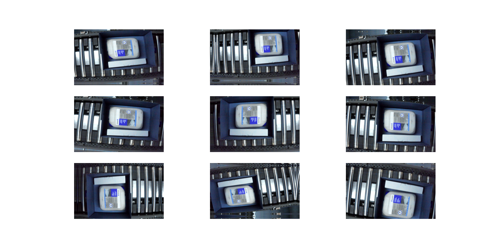
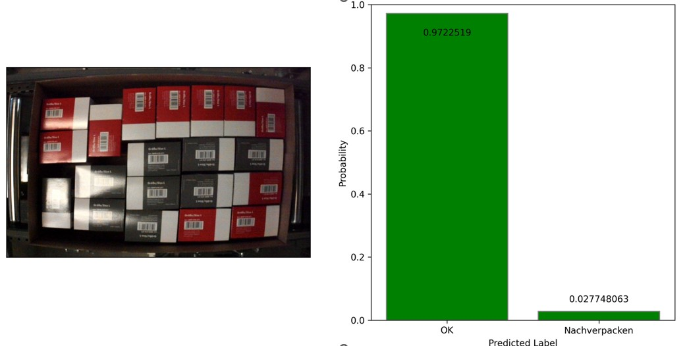
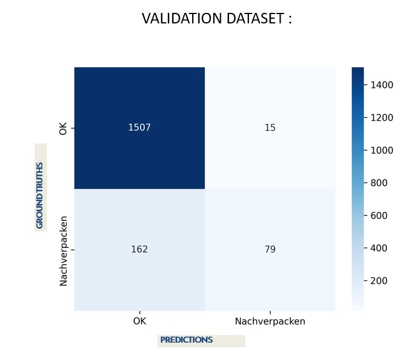
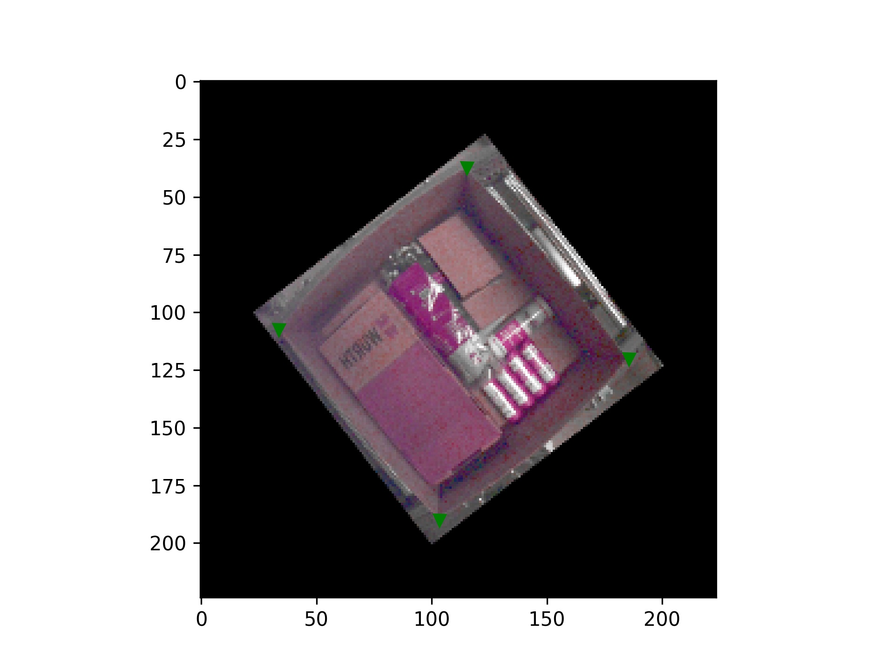
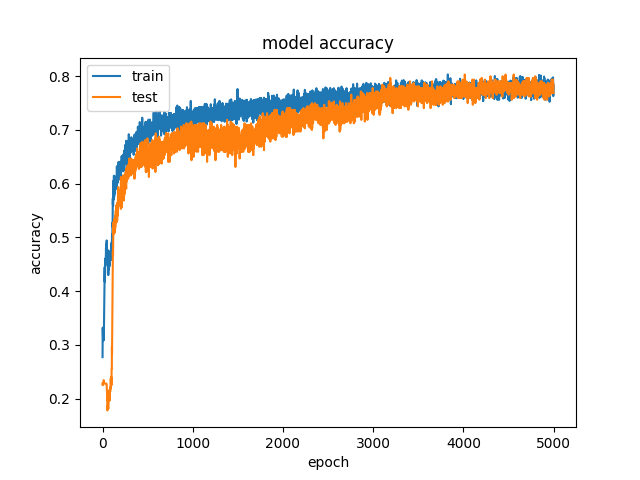
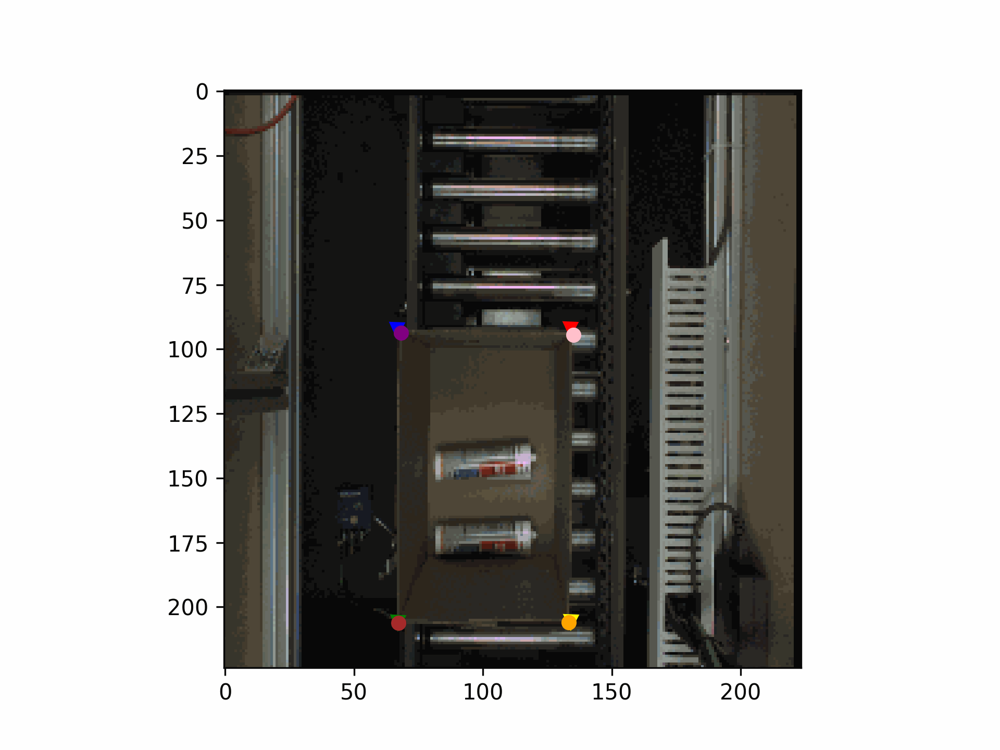
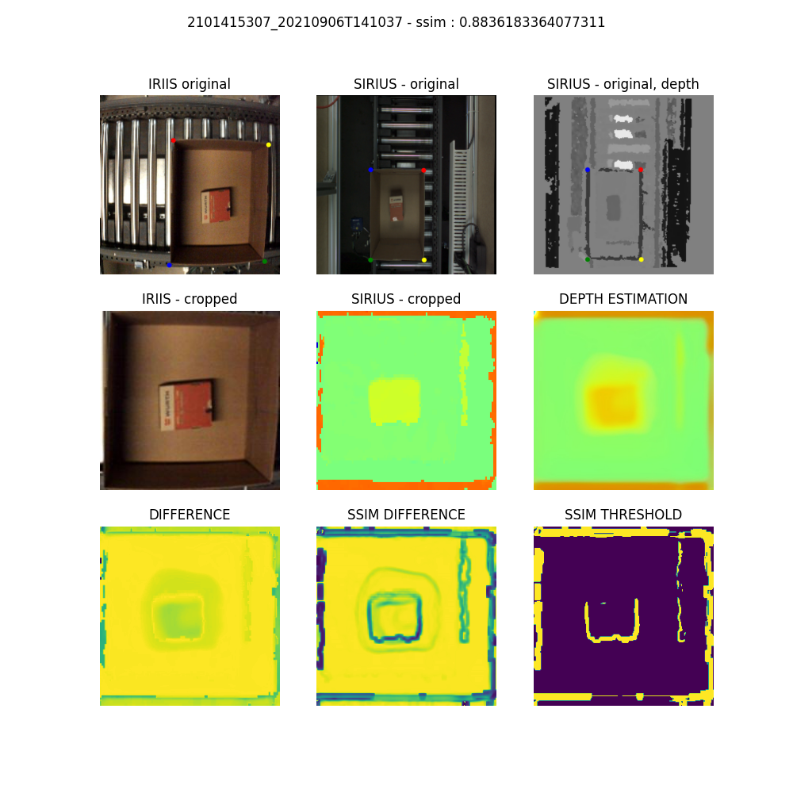
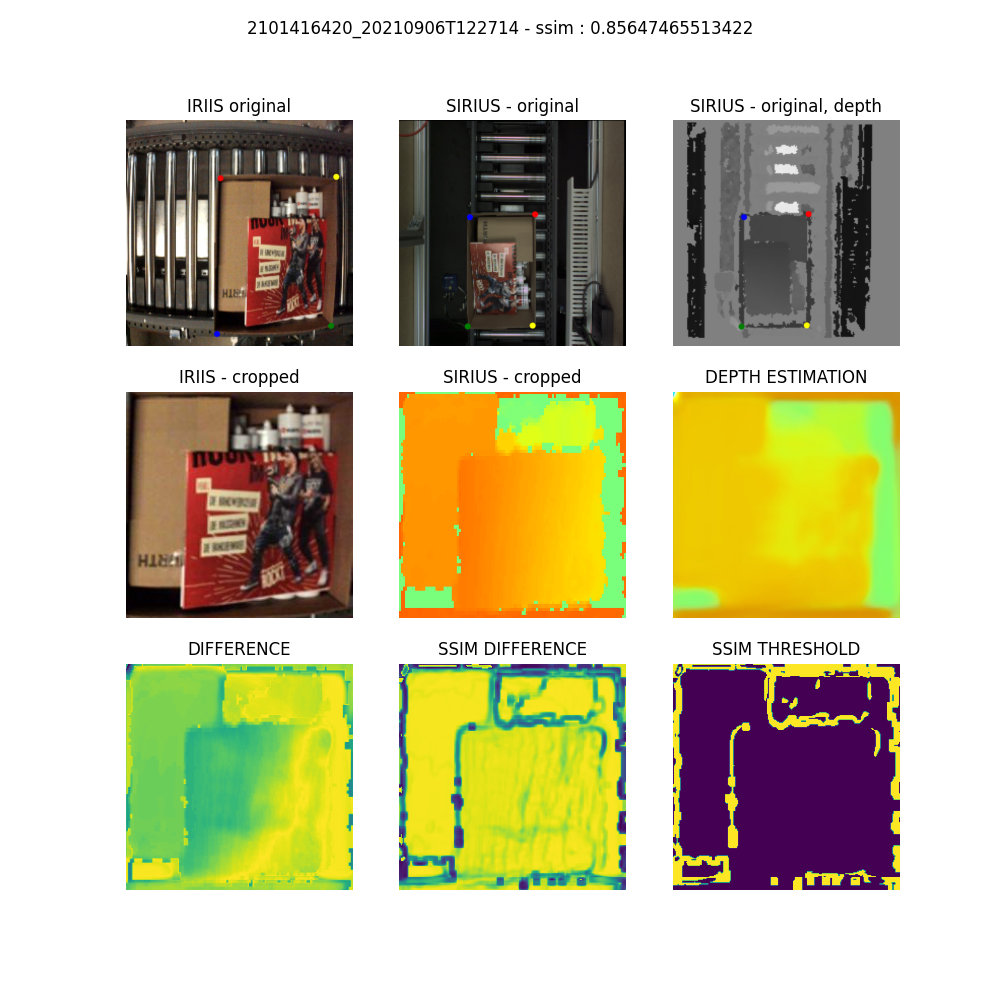
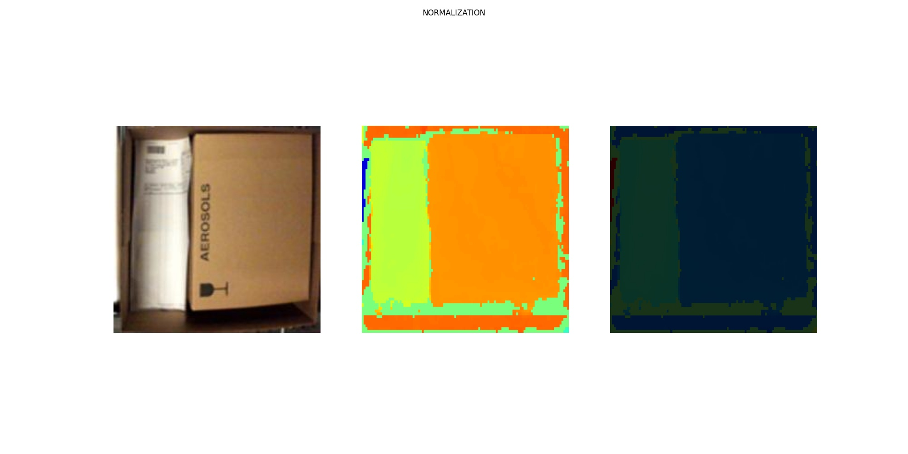

# Introduction 
Neural Image Enhancer is a Neural Network model that takes an RGB image as an input, and predicts information such as depth, volume or distance.
The idea is to use this model to calculate the volume of an empty space in a box. It is useful because then boxes can be reduced or filled with more content such as adding material if it is needed.
    

# Getting Started
 Guide :
1.	Installation process
For edditing scripts, I used PyCharm as dev environment. Language is Python. Libraries and packages are listed in "requirements.txt". 
For training, I am using Docker Container tensorflow:2.6.0-gpu
 ( https://hub.docker.com/layers/tensorflow/tensorflow/tensorflow/2.6.0-gpu/images/sha256-e0510bc8ea7dfed3b1381f92891fae3ad5b75712984c3632a60cc164391bca29?context=explore )
To annotate images, I used Visual Geometry Annotator (VIA) - https://www.robots.ox.ac.uk/~vgg/software/via/
For visualizing Image Classifier CNN, I used Netron app - https://netron.app/

2. Software dependencies
Linux OS

3. Hardware dependencies
GPU

# Build and Test
After preparing the data, we should have dataset organized in folders for each use case. 
In a folder of use case, there should be corresponding classes folders. 
For example, folder "Usecase Nachverpacken" should contain folders "OK" and "NOK" 
(in order to use keras function "Image_dataset_from_directory" for loading the datasets for training/validation).

All hyperparameters should be defined in "Configs.py" (and paths, of course).

For training, build the docker container and install all the requirements from "requirements.txt". 
After that, just run the script "learn_from_scratch.py" and follow learning curves on tensorboard. 
When you see that accuracy and loss are satisfying,
 you can stop the training and use "model_saved_at_epoch.h5" 
 (epoch which has the best accuracy and loss) for predicting the images. 

Tip : there is a augumentation layer, before running the training, do not forget to set parameter "train" in RandomColor() function to "true".
Also, when you are creating augumentation visualisations, you want that parameter to be = "false".  

Model is defined in "model_definition.py". Base model is EfficientNetB0 with "imagenet" weights. 
In learning script : "learn_from_scratch.py", you can print logs and find out the index of a layer that you want to unfreeze fisrt,
for the purpose of fine tuning. Also, Netron app is helpful here for visualisation of the whole network model.

For visualizing the results, organize dataset with "separate_train_valid_data.py", then use "prepare_results_validation.py".

# Keypoint Detector 

Keypoint Detector is a feature for detecting corners of boxes, so we can do normalization on dataset. 
That means that we can detect box - corners and then cut the box and extract just useful information.
We are detecting 4 keypoints ( 8 coordinates) and that information is stored as a parameter in Configs.py. 
If you want to use this detector for detecting some other keypoints (for example, human body keypoints), then 
you want to change this value. 

One can use "Keypoint_detec_Generator.py" to generate dataset. 
Dataset contains images and one JSON dictionary with polyline annotations. 
Example of the JSON dictionary with keypoints is stored in file : "SIRIUS Dataset.json"
Here, augumentor is a function.
When images from dataset are rotated or resized, their keypoints are projected to corresponding augumentated images. 
In script, you can find comments about that. 
With Keypoint_detec_augumentation_visual.py, it is easy to visualize augumentated examples.

Keypoint detector - neural network is defined in "Keypoint_detec_model_definition.py". 
Transfer learning method is used, base model is MobileNetV2 trained on "imagenet" which weights we are using here. 

For training and saving models, there is a script "Keypoint_detec_learning.py". 
Finally, for loading the model, predicting and saving results, I made a little tool called "Keypoint_detec_results.py". 
All paths, parameters and hyperparameters are initialized in Configs.py.  
If dataset is not already parsed and structured, "cornerDetector_dataset_preparation.py" might be useful.

Metrics that I used to measure accuracy are intersection over union (IoU) and average Euclidean Distance. 
The best model is the one that has maximal IoU and minimal average Euclidean distance.
Evaluate and compare your models with those metrics using script : Keypoint_detec_IoU.py . 

# Depth Estimator

Depth Estimator is a model that we will use for estimating depth of a rgb image. On image is a box with its content. 
We would like to know how much space in the box is taken/filled (in %). 

Dataset contains original RGB image and its depth map (one input = 2 images). 
Loading images and depth masks, and then creating batches, we can do with a Generator class in "Keypoint_detec_Generator.py" script.
It is always useful to visualize te input, so, take a look on input data with visualize_depth_map() function.

Depth Estimator Network is designed in "Depth_Estimator_Model.py". There you can find few Downscale, Bottleneck and Upscale blocks.
All the magic is happening during the training - during the optimization of the loss function.
Loss function is a combination (sum) of three loss functions. 
SSIM loss, L1 loss and depth smoothness loss. Every loss function is being multiplied by its weight.
Those weights are hyperparameters which you can change if you think that with changed values, training is going to be more stable and results more accurate.
We can inspect the results visually with our naked eye using the "Depth_Estimator_Results.py".
The best measure for similarity between images is SSIM. 
Therefore, I made a script for creating error maps of two images (ground truth depth and estimated depth).
Error maps that you can get with "Depth_Estimator_ErrorMap.py" are difference map, SSIM difference map and SSIM threshold. 
There is also line in a script that is printing out calculated SSIM. 

It remains to normalize the depth estimation and calculate the percentage of occupied space in the box.
That we can do with "Depth_Estimator_results_normalization.py" and "Depth_Estimator_Calculate_Area.py".

Visuals, motivation and idea are presented in NEURAL_IMAGE_ENHANCER.pptx. 

References : 
https://keras.io/examples/vision/keypoint_detection/
https://keras.io/examples/vision/depth_estimation/